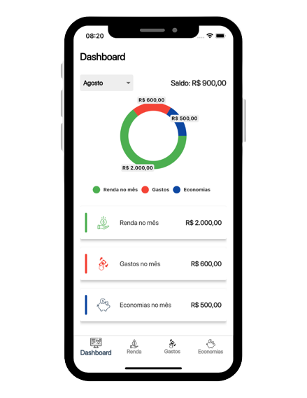
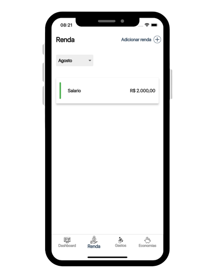
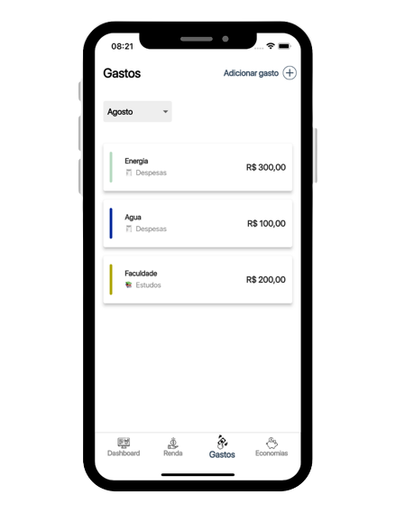
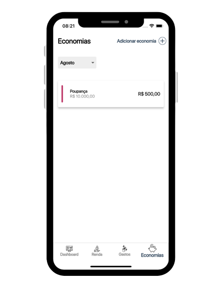

<p align="center">
   <a href="https://img.shields.io/github/last-commit/felipesses/myexpenses?label=%C3%BAltimo%20commit">
    
  </a>
  
  </a>

</p>
<h1 align="center">
    My Expenses
</h1>


<p align="center">
 <a href="#-sobre-o-projeto">Sobre</a> •
 <a href="#-funcionalidades">Funcionalidades</a> •
 <a href="#-layout">Layout</a> • 
 <a href="#-como-executar-o-projeto">Como executar</a> • 
 <a href="#-tecnologias">Tecnologias</a> • 
 <a href="#-autor">Autor</a> • 
 <a href="#user-content--licença">Licença</a>
</p>


## 💻 Sobre o projeto

🧾 My Expenses - é uma ideia que surgiu a partir de uma necessidade do desenvolvedor Felipe Magalhães de ter um controle melhor dos seus gastos, podendo assim ter uma ideia do quanto estava recebendo, gastando e economizando todos os meses. O projeto é open source e conta com possíveis colaboadores tanto para sugerir novas ideias quanto para implementar novas funcionalidades.


## ⚙️ Funcionalidades

Confira no changelog


## 🎨 Layout


### Mobile

<p align="center">
  

  
  
  

  
</p>


---

## 🚀 Como executar o projeto

### Pré-requisitos

Antes de começar, você vai precisar ter instalado em sua máquina as seguintes ferramentas:
[Git](https://git-scm.com), [Flutter](https://docs.flutter.dev/get-started/install). Além disto é bom ter um editor para trabalhar com o código como [VSCode](https://code.visualstudio.com/)

É importante também que você possua um emulador de Android ou iOS disponível na sua máquina, o projeto roda em dispositivos Android com versões iguais ou maiores do que 21 do build e em dispositivos iOS com versões iguais ou maiores do que 10.0.


### 📲 Rodando o projeto (mobile)

```bash

# Clone este repositório
$ git clone git@github.com:felipesses/myexpenses.git

# Acesse a pasta do projeto no terminal/cmd
$ cd myexpenses

# Aplique um clean no projeto
$ flutter clean

# Instale os pacotes e dependências
$ flutter pub get

# Execute a aplicação em algum emulador ou dispositivo
$ flutter run

```

---

## 🛠 Tecnologias

Essas foram as principais ferramentas utilizadas na construção do projeto:

#### **Flutter** 

-   **[mobx](https://pub.dev/packages/mobx)** ^2.0.7+5
-   **[flutter_mobx](https://pub.dev/packages/flutter_mobx)** ^2.0.6+1
-   **[flutter_modular](https://pub.dev/packages/flutter_modular)** ^5.0.3
-   **[sqflite](https://pub.dev/packages/sqflite)** ^2.0.3+1
-   **[shared_preferences](https://pub.dev/packages/shared_preferences)** ^2.0.15
-   **[pie_chart](https://pub.dev/packages/pie_chart)** ^5.3.2
-   **[group_button](https://pub.dev/packages/group_button)** ^5.0.1
-   **[flutter_slidable](https://pub.dev/packages/flutter_slidable)** ^2.0.0


#### [](https://github.com/tgmarinho/Ecoleta#utilit%C3%A1rios)**Utilitários**

-   Editor:  **[Visual Studio Code](https://code.visualstudio.com/)** 
-   Markdown:  **[StackEdit](https://stackedit.io/)**
-   Ícones:   **[Font Awesome](https://fontawesome.com/)**
-   Fontes:  **[San Francisco](https://www.dafontfree.io/san-francisco-font-free/)**


---


## 💪 Como contribuir para o projeto

1. Faça um **fork** do projeto.
2. Crie uma nova branch a partir de development com as suas alterações: `git checkout -b my-feature`
3. Salve as alterações e crie uma mensagem de commit contando o que você fez: `git commit -m "feature: my new feature"`
4. Envie as suas alterações: `git push origin my-feature`

---

## 🦸 Autor

<a href="https://media-exp1.licdn.com/dms/image/C4E03AQEbuFeqUG9NvA/profile-displayphoto-shrink_800_800/0/1651065770250?e=1667433600&v=beta&t=YHEXEN2oROeU5eVj3xdpZsbaK4CDBMlbwBKMF-5QvW4">
 
 <br />
 <sub><b>Felipe Magalhães</b></sub></a> <a href="https://www.linkedin.com/in/felipemagalhaes13/" title="Felipe Magalhaes">🚀</a>
 <br />

[](https://www.linkedin.com/in/felipemagalhaes13/) 
[](mailto:felipeme73@gmail.com)

---

## 📝 Licença

Este projeto esta sobe a licença [MIT](./LICENSE.md).

Feito com ❤️ por Felipe Magalhães 👋🏽 [Entre em contato!](https://www.linkedin.com/in/felipemagalhaes13/)

